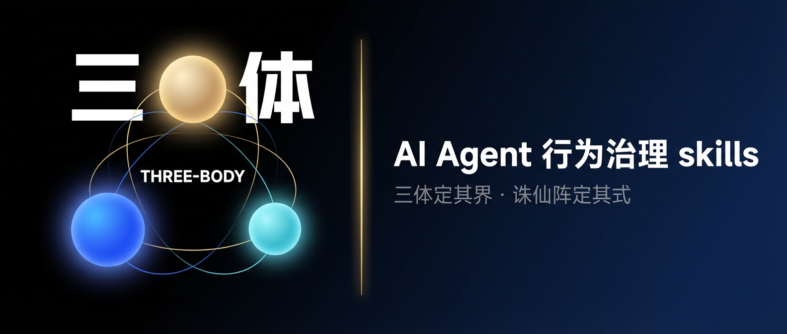

# 🌌 three-body

<div align="center">

**AI Agent Governance Universe · Inspired by *The Three-Body Problem***

[](./LICENSE)
[](./install.sh)
[](./UNIVERSE.md)
[](./ARCHITECTURE.md)
[](./ARCHITECTURE.md)

<p align="center">
  <a href="#why-this-repository-exists">Why</a> ·
  <a href="#current-architecture-phase-2">Architecture</a> ·
  <a href="#what-each-of-the-7-skills-does">Skills</a> ·
  <a href="#what-to-install-and-when">Install</a> ·
  <a href="#best-fit-scenarios">Best fit</a>
</p>

<p align="center">
  
</p>

> **Three-Body defines the boundary. Zhu Xian Formation decides the approach.**
>
> A governance system for AI agents:
> not just **what to do**, but **when to pause, when to plan, when to inspect evidence, and when not to proceed at all**.

[中文版](./README.md) · [Architecture](./ARCHITECTURE.md) · [Universe Map](./UNIVERSE.md) · [Installer](./install.sh)

</div>

---

## Why this repository exists

Most agent skills solve only one narrow problem: how to write code, how to call tools, or how to sound smart in a system prompt.

In practice, agent failures usually start earlier in the chain:

1. **The agent never chose the right working mode**
2. **The safety boundary was never made explicit**
3. **Complex work went straight into execution without planning**
4. **The plan looked reasonable because nobody tried to break it**
5. **High-risk actions had no final decision maker**
6. **Failures were retried from intuition instead of evidence**

**three-body** is built around that full chain.

---

## Problems it solves

| Real problem | Typical failure mode | three-body's answer |
|---|---|---|
| The agent starts doing immediately | It codes when it should first inspect | `agent-work-environment-v3` selects the working formation |
| Safety boundary is unclear | It proceeds when it should pause | `environment-governance` defines the boundary |
| Complex work is improvised mid-flight | Plans drift and rework gets expensive | `wallfacer` plans first |
| Plans are never challenged | Hidden assumptions explode during implementation | `wallbreaker` attacks the plan |
| High-risk actions lack a final decider | Risk is known, but no one authorizes | `swordbearer` makes the final call |
| Failures are retried from guesswork | No archive reading, repeated mistakes | `diagnostic-archive` restores the evidence trail |

> **three-body cares less about "starting faster" and more about getting the direction and the boundary right first.**

---

## 30-second understanding

If you only want the core idea, keep these four lines:

- **Zhu Xian Formation** decides the working mode first
- **Three-Body Laws** define the current boundary second
- **The three strategy roles** appear only when work is complex or risky
- **Archive Reader** pulls the system back to evidence after failure

The shortest way to think about it is this: it restructures the agent behavior chain into:

> **mode selection → boundary definition → strategic intervention → evidence recovery**

---

## Where the naming comes from

### Three-Body defines the boundary

What *The Three-Body Problem* gives this repository is a strong **boundary philosophy**.

- Context is scarce, so resources must be conserved
- Environments mutate, so escalation paths matter
- Broader exposure increases failure surface: that is the Dark Forest law in agent terms
- High-risk actions should be governed by deterrence and decision, not impulse

> **Dark Forest is a governing law here. It frames how exposure and caution are understood; it is not a concrete execution skill.**

### Zhu Xian Formation decides the approach

What Zhu Xian Formation gives this repository is a **task-mode model**.

The same user request can require completely different modes: inspect first, implement directly, verify first, write documentation, or operate carefully in ops mode.

That is why `agent-work-environment-v3` starts by deciding:

> **which formation the work should enter.**

**Five formations at a glance**: Guan Ji (Research) · Po Ju (Implementation) · Ming Jian (Verification) · Li Yan (Writing) · Xing Ling (Operations)

---

## Current architecture (Phase 2)

```text
┌────────────────────────────────────────────────────────────────────┐
│                         TACTICS LAYER                              │
│   ⚔️ agent-work-environment-v3                                     │
│   Zhu Xian Formation: choose research / implement / verify /       │
│   writing / ops mode from task intent                              │
└────────────────────────────────────────────────────────────────────┘
                              │
                              ▼
┌────────────────────────────────────────────────────────────────────┐
│                       GOVERNANCE LAYER                             │
│   ⚖️ environment-governance                                        │
│   Three-Body Laws: define confirmation, escalation, writeback,     │
│   and diagnostic boundaries from task signals                      │
│   Core philosophy: Dark Forest law — control exposure first        │
└────────────────────────────────────────────────────────────────────┘
                              │
                              ▼
┌────────────────────────────────────────────────────────────────────┐
│                         STRATEGY LAYER                             │
│   🧱 wallfacer   → deep planning                                    │
│   🔓 wallbreaker → adversarial challenge                            │
│   ⚔️ swordbearer → final authorization for high-risk actions        │
└────────────────────────────────────────────────────────────────────┘
                              │
                              ▼
┌────────────────────────────────────────────────────────────────────┐
│                          EVIDENCE LAYER                            │
│   📁 diagnostic-archive                                            │
│   Read run archives, locate root causes, and provide evidence      │
└────────────────────────────────────────────────────────────────────┘
```

## What each of the 7 skills does

### The 6 roles in the main architecture

| Skill | Layer | Role | Responsible for | Not responsible for |
|---|---|---|---|---|
| `agent-work-environment-v3` | Tactics | Zhu Xian Formation | detect task intent, choose the formation | does not define safety laws, deep-plan, or authorize |
| `environment-governance` | Governance | Three-Body Laws | define boundaries from risk, complexity, failure state | does not route tasks or replace execution skills |
| `wallfacer` | Strategy | Wallfacer | converge candidate paths and choose a main plan | does not challenge its own plan or authorize |
| `wallbreaker` | Strategy | Wallbreaker | break plans, expose blind spots | does not create the first plan |
| `swordbearer` | Strategy | Swordbearer | final allow/pause/deny decision on high-risk actions | does not perform the full risk-identification layer |
| `diagnostic-archive` | Evidence | Archive Reader | read archives and reconstruct failure evidence | does not fix bugs or rerun tasks |

### The 1 compatibility skill

| Skill | Position |
|---|---|
| `agent-work-environment` | Compatibility combined version — merges routing + governance into one skill for users who want a single install path |

---

## How they work together

### Standard task
```text
User task → agent-work-environment-v3 → environment-governance → execution skill
```

### Complex task
```text
User task → agent-work-environment-v3 → environment-governance → wallfacer → execution skill
```

### Complex and controversial task
```text
User task → agent-work-environment-v3 → environment-governance → wallfacer → wallbreaker → execution skill
```

### High-risk task
```text
User task → agent-work-environment-v3 → environment-governance → swordbearer → careful/guard/execution skill
```

### High-risk task that already failed before
```text
User task → agent-work-environment-v3 → environment-governance → diagnostic-archive → swordbearer → execution skill
```

---

## What to install and when

### I only want the core setup
```bash
./install.sh claude
```
Installs: `agent-work-environment-v3` + `environment-governance`

### I need failure diagnosis
```bash
./install.sh claude --with-archive
```
Adds: `diagnostic-archive`

### I need the full strategy layer
```bash
./install.sh claude --with-strategy
```
Adds: `wallfacer` + `wallbreaker` + `swordbearer`

### Recommended full install
```bash
./install.sh claude --with-strategy --with-archive
```

---

## Supported platforms

| Platform | Identifier | Status |
|---|---|---|
| Claude Code | `claude` | ✅ verified |
| Opencode | `opencode` | ✅ verified |
| OpenClaw | `openclaw` | ✅ verified |

---

## What changes after installation

If you suspect this is "just a prettier system prompt," look at [examples/behavior-diff.md](./examples/behavior-diff.md).

It compares three states: no three-body installed, only `environment-governance`, and routing + governance together.

The real change is in the **decision chain**.

---

## Best-fit scenarios

**A good fit if you:**
- use coding agents continuously, not just for one-off prompts
- care about high-risk boundaries, not only speed
- want complex tasks to be planned before execution
- want failures investigated from evidence

**Probably overkill if you only need:**
- single-turn Q&A
- a few quick code lines
- no safety boundary or behavior consistency at all

---

## Technical roadmap

**Phase 1: foundational layer** (completed)
- `environment-governance` · `agent-work-environment-v3` · `diagnostic-archive`
- Core value: choose the mode, define the boundary, read the evidence

**Phase 2: strategy layer** (completed)
- `wallfacer` · `wallbreaker` · `swordbearer`
- Core value: plan, challenge, authorize

**Phase 3: intelligence and long memory** (planned)
- `sophon` — not implemented yet

---

## Repository structure

```text
three-body/
├── README.md / README_EN.md
├── ARCHITECTURE.md / UNIVERSE.md
├── environment-governance/      # Three-Body Laws
├── agent-work-environment-v3/   # Zhu Xian Formation
├── diagnostic-archive/          # Archive Reader
├── wallfacer/                   # Wallfacer
├── wallbreaker/                 # Wallbreaker
├── swordbearer/                 # Swordbearer
└── scripts/
    ├── validate-repo.ps1
    └── build-skill-packages.ps1
```

---

## Design principles

1. **Layer before combination** — do not begin with one giant control skill
2. **Recognize before authorize** — governance identifies risk; swordbearer decides passage
3. **Plan before execution** — complex work should not jump straight into implementation
4. **Challenge before commitment** — expensive plans should be broken once before being trusted
5. **Evidence before conclusion** — after failure, inspect archives before retrying

---

## If this is your first time here

**5-minute path:**
1. Read "30-second understanding"
2. Read "Current architecture (Phase 2)"
3. Read "How they work together"
4. Decide between core install and full install

**For deeper reading:**
- Full interaction model → [ARCHITECTURE.md](./ARCHITECTURE.md)
- Long-term roadmap → [UNIVERSE.md](./UNIVERSE.md)

---

## License

[MIT](./LICENSE)

---

<div align="center">

**Three-Body defines the boundary. Zhu Xian Formation decides the approach.**

Many agent stacks optimize for "start doing faster."  
three-body puts more weight on a different question: **are we about to start in the wrong direction?**

[Architecture](./ARCHITECTURE.md) · [Universe Map](./UNIVERSE.md) · [中文版](./README.md)

</div>
